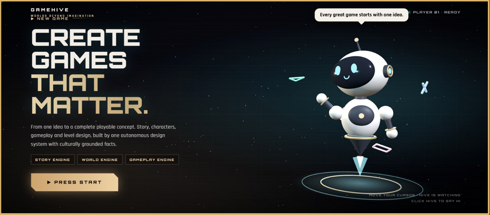
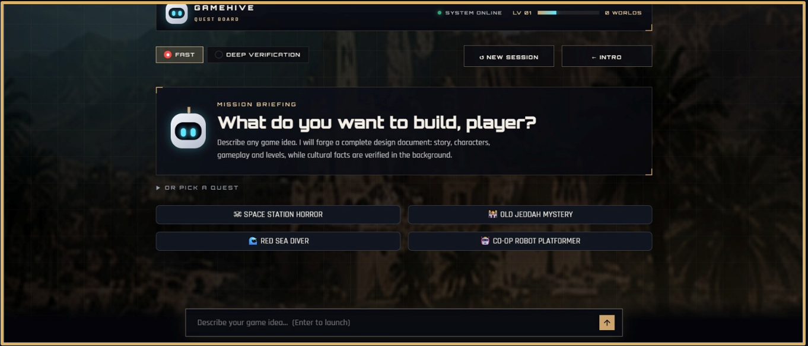
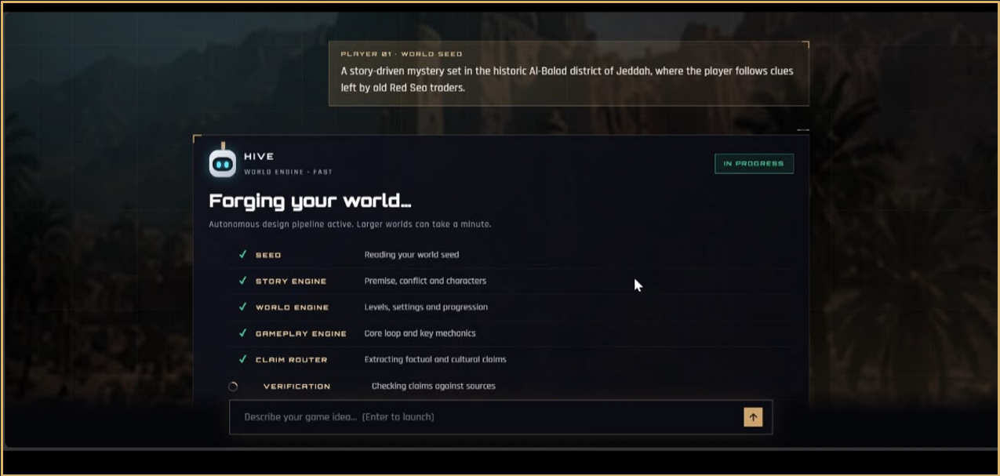
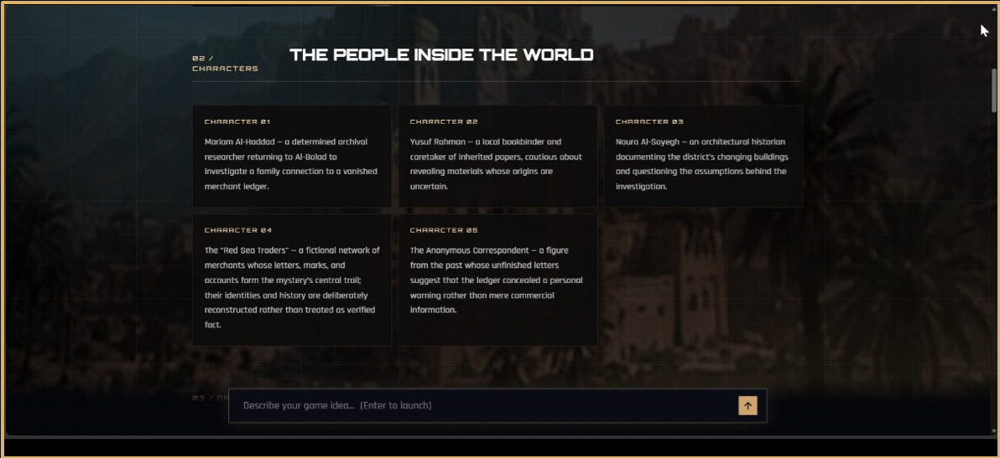
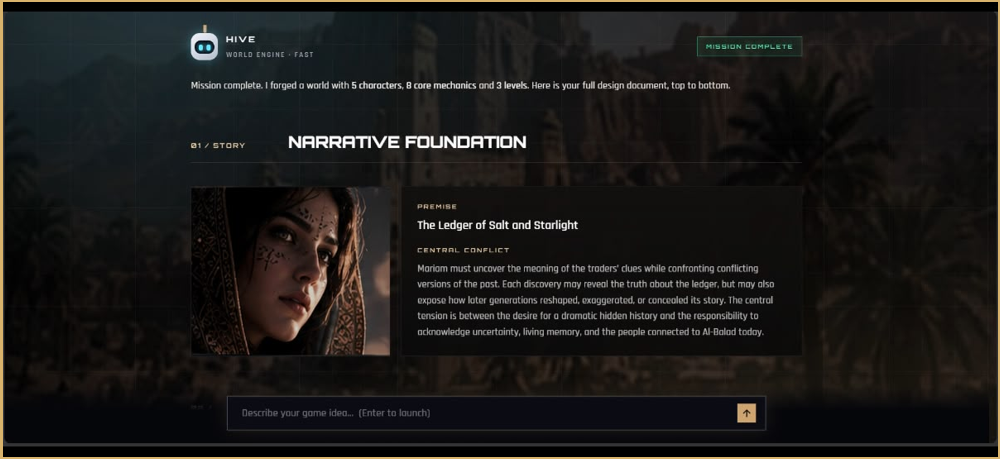

# GameHive Agents

### Agentic AI Multi-Agent System for Game Design, Verification, and Self-Correction

GameHive transforms a simple game idea into a structured game concept using specialized AI agents for story development, world building, gameplay design, verification, and iterative self-correction.



---

## Why GameHive?

Traditional AI generation tools often rely on a single model response.

GameHive uses a coordinated multi-agent architecture where specialized AI agents collaborate, verify outputs, detect inconsistencies, and refine results before producing the final game design.

The goal is to move beyond simple prompt-response generation and create a structured AI workflow capable of planning, generating, validating, and improving its own outputs.

---

## Highlights

- Multi-Agent AI Architecture
- Agentic AI Workflow
- Retrieval-Augmented Generation (RAG)
- Story, World & Gameplay Agents
- Cultural & Factual Verification
- Claim Extraction and Routing
- Game-State Consistency Checking
- Automated Revision Gates
- Self-Correction Pipeline
- Interactive Game Design Interface
- Modular Python Architecture

---


## Demo

Watch GameHive in action:

[View Demo](https://drive.google.com/file/d/1MhXcEGDHTWvQQlZFzYvpy8g2MYnYK73f/view?usp=drive_link)
## System Architecture

```text
User Game Idea
      ↓
Story Agent
      ↓
World Engine
      ↓
Gameplay Agent
      ↓
Claim Extraction
      ↓
Claim Routing
      ↓
Verification
      ↓
Revision Gate
      ↓
Self-Correction
      ↓
Final Game Design Output
```

The workflow allows each AI component to focus on a specific responsibility while maintaining consistency across the generated game concept.

---

## Core AI Agents

| Agent | Responsibility |
|---|---|
| Story Agent | Generates narrative structure, conflicts, and characters |
| World Engine | Builds game settings, world rules, and progression |
| Gameplay Agent | Designs gameplay mechanics and player interactions |
| Level Design Agent | Structures levels and progression concepts |
| Claim Extractor | Identifies factual and cultural claims in generated content |
| Claim Scope Router | Routes extracted claims to the appropriate verification process |
| Culture Verifier | Evaluates cultural accuracy and contextual appropriateness |
| Game State Verifier | Checks consistency across generated game elements |
| Revision Gate | Determines whether generated content requires revision |
| Self-Correction Controller | Coordinates refinement and correction cycles |

---

## System in Action

### Landing Page


The main GameHive interface introduces the platform and provides a clear entry point into the AI-assisted game creation workflow.

### Game Idea Input



Users can submit a custom game concept or select from predefined prompts. This stage acts as the initial input layer for the multi-agent pipeline.

### Multi-Agent Workflow



The system orchestrates specialized AI agents for story generation, world building, gameplay design, claim routing, and verification within a structured workflow.

### Narrative Generation



GameHive generates a structured narrative foundation including the premise, central conflict, characters, and contextual elements derived from the original game idea.

### Generated Characters



The system produces structured character profiles with defined roles, motivations, and relationships aligned with the generated world and narrative.

---

## What Makes GameHive Different?

GameHive is not a simple chatbot or single-prompt content generator.

It uses specialized AI agents, verification stages, routing logic, and self-correction mechanisms to create more structured, consistent, and reliable game design outputs.

The architecture demonstrates how Agentic AI can coordinate multiple intelligent components around one complex creative task.

---

## Technology Stack

- Python
- Agentic AI
- Multi-Agent Systems
- Large Language Models
- Retrieval-Augmented Generation (RAG)
- Vector Databases
- Prompt Engineering
- Workflow Orchestration
- AI Verification
- Self-Correcting AI Systems

---

## Project Structure

```text
gamehive-agents/
│
├── agents/
│   ├── claim_extractor.py
│   ├── claim_scope_router.py
│   ├── culture_verifier.py
│   ├── game_state_verifier.py
│   ├── gameplay_agent.py
│   ├── level_design_agent.py
│   ├── revision_gate.py
│   ├── self_correction_controller.py
│   └── story_agent.py
│
├── RAG/
│   ├── __init__.py
│   ├── build_index.py
│   ├── evidence_pack.py
│   ├── evidence_retrv.py
│   └── ingest_sources.py
│
├── workflow/
│   ├── __init__.py
│   └── gamehive_graph.py
│
├── assets/
│   ├── landing-page.png
│   ├── game-idea-input.png
│   ├── agent-workflow.png
│   ├── narrative-output.png
│   └── generated-characters.png
│
├── app.py
├── main.py
├── state.py
├── requirements.txt
├── .gitignore
└── README.md
```

---

## Installation

Clone the repository:

```bash
git clone https://github.com/Ragadsul4/gamehive-agents.git
```

Navigate to the project directory:

```bash
cd gamehive-agents
```

Create a virtual environment:

```bash
python -m venv .venv
```

Activate the virtual environment on Windows:

```bash
.venv\Scripts\activate
```

Install the required dependencies:

```bash
pip install -r requirements.txt
```

---

## Environment Variables

The project may require API credentials for external AI services.

Create a local `.env` file and configure the required keys:

```text
YOUR_API_KEY=your_api_key_here
```

Never upload the `.env` file or private API credentials to the public repository.

---

## Running the Project

Run the main application:

```bash
python app.py
```

Depending on the project configuration, the application may also be started using:

```bash
python main.py
```

---

## Skills Demonstrated

- AI Engineering
- Agentic AI
- Multi-Agent System Design
- Python Development
- LLM Application Development
- Retrieval-Augmented Generation
- AI Workflow Design
- Prompt Engineering
- Vector Search
- AI Verification
- Self-Correcting AI
- Modular Software Architecture
- AI Product Development

---

## Project Goal

GameHive explores how autonomous specialized AI agents can collaborate to solve a complex creative task.

The system is designed to plan, generate, verify, route, and refine outputs through a coordinated Agentic AI workflow rather than relying on a single model response.

---

## Future Development

- Additional specialized game-development agents
- Advanced agent memory
- Expanded RAG knowledge sources
- Enhanced verification mechanisms
- Persistent game-development sessions
- More user control over agent behavior
- Exportable game design documents
- Integration with game development engines
- Improved monitoring of agent decisions and workflow states

---

## Author

Developed as an AI Engineering and Agentic AI project focused on multi-agent collaboration, RAG, verification, structured orchestration, and self-correcting AI systems.
